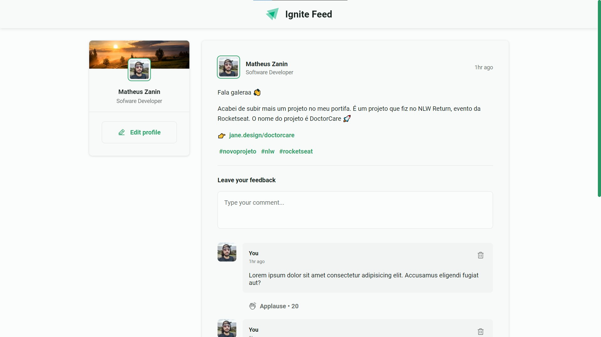
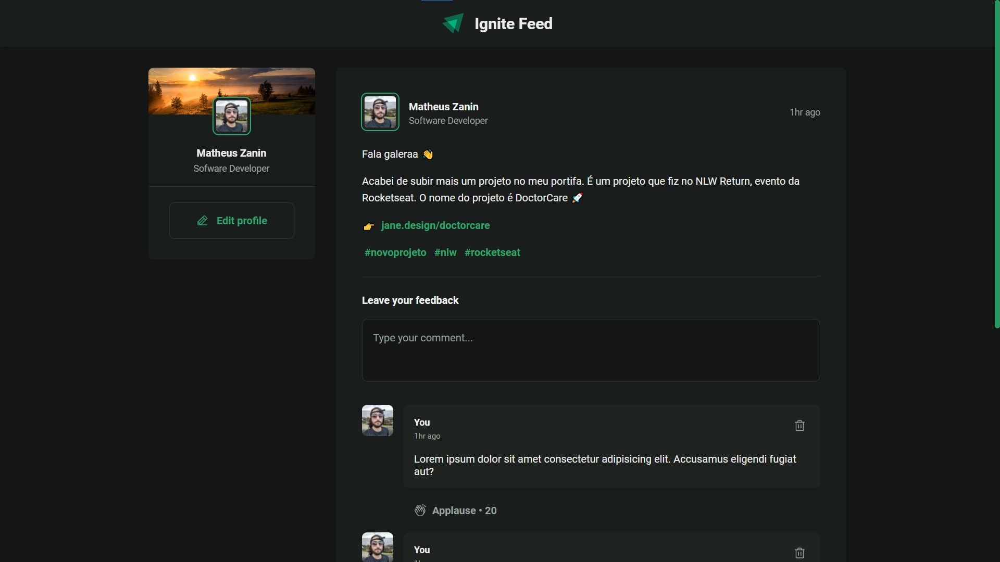

<div align="center">
  <h1>
    Ignite Feed
  </h1>

  > Posts feed application for Ignite Bootcamp.

  <strong>🚧 Under development... 🚧</strong>

  [](https://app.netlify.com/sites/ignite-feed/deploys)
</div>

<div align="center">
  

  > <small>Posts feed on light mode ☀</small>
</div>

<div align="center">
  

  > <small>Posts feed on dark mode 🌑</small>
</div>


## 💡 You will need

- First, a cup of coffee; ☕
- [Node JS](https://nodejs.org) installed on your host.

## 🎉 Starting

### Clone

In order to clone the project (via HTTPS), run this command:

```bash
git clone https://github.com/MattZ6/ignite-feed.git
```

> 💡 SSH URLs provide access to a Git repository via SSH, a secure protocol. If you have a SSH key registered in your Github account, clone the project using this command: `git clone git@github.com:MattZ6/ignite-feed.git`


Go to project folder:

```bash
cd ignite-feed
```

### Dependencies

Install the project dependencies:

```bash
yarn
```
> You can also run `npm i` instead.

### Develop

Start local development server:

```
yarn dev
```
> You can also run `npm run dev` instead.

## 🤝 Contributing

> Contributions, issues and new features are **always welcome**! You can explore them [here](https://github.com/MattZ6/ignite-feed/issues).

Feel free to submit a new issue with a respective title and description on the the Auth Flow API repository. If you already found a solution to your problem, i would love to review your pull request! Have a look at our [contribution guidelines](.github/CONTRIBUTING.md) to find out about the coding standards.


## 📜 License

Released in 2022 © This project is under [MIT License](LICENSE.md).

## 👨‍🎤 Author

Made with ❤ by [Matheus Felipe Zanin](https://github.com/MattZ6).<br/>
[Get it touch](https://www.linkedin.com/in/mattz6)!
___

<div align="center">
  <strong>Ignite Bootcamp 🔥</strong>
</div>
